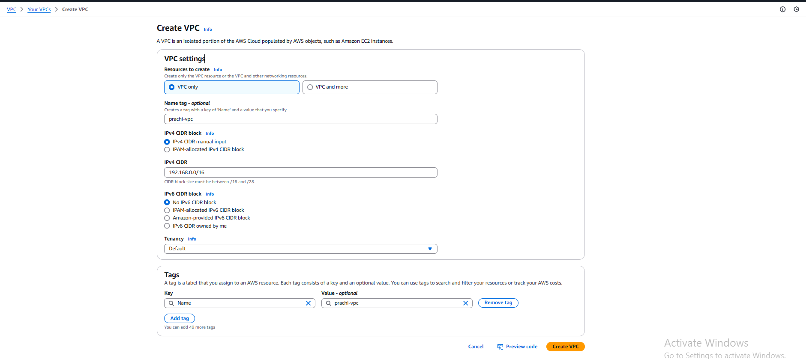

# Creating a Custom VPC on AWS , launch an Ec2 Instance and Run An website-into it.

This guide will walk you through the steps to create a custom VPC (Virtual Private Cloud) on AWS. We'll cover everything from setting up the basic infrastructure to launching instances within the VPC.

## Prerequisites

- An AWS account
- Basic understanding of AWS services

## Definitions

- _VPC (Virtual Private Cloud)_: A logically isolated section of the AWS cloud where you can launch AWS resources in a virtual network that you define.
- _CIDR (Classless Inter-Domain Routing)_: A method for allocating IP addresses and routing.
- _Subnet_: A range of IP addresses in your VPC. You can launch AWS resources into a specific subnet.
- _Internet Gateway_: A horizontally scaled, redundant, and highly available VPC component that allows communication between instances in your VPC and the internet. (Bi_Directional)
- _Route Table_: A set of rules, called routes, that are used to determine where network traffic is directed.
- _NAT Gateway_: A network address translation (NAT) service that enables instances in a private subnet to connect to the internet or other AWS services, but prevents the internet from initiating a connection with those instances.(One Directional)

## Steps to Create a Custom VPC

### 1. Log into the AWS Management Console

Go to [AWS Management Console](https://aws.amazon.com/console/) and log in.

### 2. Navigate to the VPC Dashboard

1. Search for "VPC" in the search bar.
2. Click on "VPC" under "Networking & Content Delivery".

   

### 3. Create a New VPC

1. Click on "Create VPC".
2. Provide the following details:
   - _Name tag_: custom_VPC
   - _IPv4 CIDR block_: Specify a CIDR block (e.g., 10.0.0.0/16).
   - _IPv6 CIDR block_: Optional.
   - _Tenancy_: Choose "Default.
3. Click "Create VPC".

   
   

### 4. Create Subnets

1. Click on "Subnets".
2. Click "Create Subnet".
3. Provide details:
   - _Name tag_: Name your subnet.
   - _VPC ID_: Select your VPC.
   - _Availability Zone_: Choose a zone.
   - _IPv4 CIDR block_: Specify a CIDR block (e.g., 10.0.1.0/24).
4. Click "Create Subnet".
5. Repeat for additional subnets.

   

#### Note:

- public & private subnets are just names given to subnets that aren't configured yet

- Defaultly subnets are attached to Route Table which is created after creation of custom_VPC as shown in the picture below
- It means a route table is created after creation of Custom_VPC

  

### 5. Create an Internet Gateway

1. Click on "Internet Gateways".
2. Click "Create Internet Gateway".
3. Name the gateway and click "Create".
4. Attach the gateway to your VPC:

   - Select the gateway.
   - Click "Actions" > "Attach to VPC".
   - Choose your VPC and click "Attach".

   
   

### 6. Configure Route Tables

#### Public Route Table

1. Click on "Route Tables".
2. Click "Create Route Table".
3. Provide details:
   - _Name tag_: PublicRouteTable
   - _VPC_: Select your VPC.
4. Click "Create".

   

#### Priblic Route Table

1. Click on "Route Tables".
2. Click "Create Route Table".
3. Provide details:
   - _Name tag_: PrivateRouteTable
   - _VPC_: Select your VPC.
4. Click "Create".
   

- To check how configuration is setup we can see it resource map.

  

5. Associate with your public subnet:

   - Click "Subnet associations".
   - Click "Edit subnet associations".
   - Select your public subnet and click "Save".

   
   

6. Select the route table and click "Routes".
7. Click "Edit routes" and add:
   - _Destination_: 0.0.0.0/0
   - _Target_: Internet Gateway
8. Click "Save changes".

   
   

#### Notes:

- 0.0.0.0/0 represents include the IP addresses only from reseptive subnets,it means we cannot replace 0.0.0.0/0 with your VPC IP address

- Route table is a subnet level assosication not with at VPC level

### 7. Create a NAT Gateway (Optional)

1. Click on "NAT Gateways".
2. Click "Create NAT Gateway".
3. Provide details:
   - _Name_: custom_NAT
   - _Subnet_: Choose a private subnet.
   - _Public_: enable
   - _Elastic IP_: Allocate new Elastic IP.
4. Click "Create NAT Gateway".

   

5. Update the private route table:

   - Add a route with destination 0.0.0.0/0 and target the NAT Gateway from drop down as shown in the figure.

   

- After Configuration

  

#### Notes:

- NAT Gateway needs a Elastic IP (Stable Public address)

### 8. Launch Instances in Your VPC

1. Navigate to the EC2 dashboard.
2. Click "Launch Instance".
3. Choose an AMI and instance type.
4. Configure instance details:
   - _Network_: Select VPC(Custom_VPC).
   - _Subnet_: Choose a Public subnet.
   - _Auto-assign Public IP_: Enable for public subnets.
5. select new.key pair from drop down
6. Add storage, tags, and configure security groups(Open for SSH , HTTP).
7. Review and launch the instance.

   

8. logged in into instance
   `ssh -i /path/to/your-key.pem ec2-user@<EC2-Public-IP>`

### Testing for inbound access


### Run an website into an Ec2 Instace

1. Install Nginx Webserver, unzip to run an Website into it.

```bash
      sudo apt update
      sudo apt install nginx -y
      sudo apt install unzip -y
```

2. Download the website

```bash
   cd /tmp
   sudo wget https://www.free-css.com/assets/files/free-css-templates/download/page296/inance.zip
   sudo unzip inance.zip
   sudo mv /tmp/inance.zip /var/www/html/inance
```

3. Go to Browser and type `http://<public-ip>:80`

- nginx Webserver will Open

   

- To access the website `http://<public-ip>:80/inance`


    

## Conclusion

We have successfully created a custom VPC on AWS. We can now manage and use our VPC to deploy resources securely.

Happy learning, Prachi! 😊🎉
